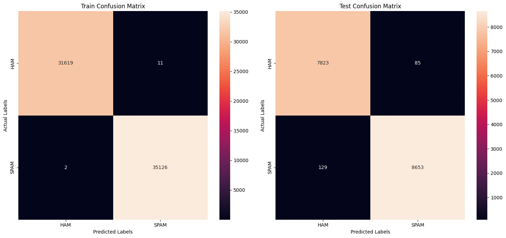

# <center>Spam Mail Classification</center>

## Objective 🏠
The goal of this project is to develop a machine learning model that classifies emails as either "Spam" or "Ham" (non-spam). The primary goal is to create a robust and accurate classification system that can effectively identify and filter out unwanted spam emails from legitimate messages, thereby improving email management and user experience.

---

## About the Dataset 📊

- Download the dataset from here: [Kaggle Dataset](https://www.kaggle.com/datasets/purusinghvi/email-spam-classification-dataset) 

<center></center>
<br>

This dataset containing 83K+ records of email which are labelled as either spam or not-spam. It is formed by combining the 2007 TREC Public Spam Corpus and Enron-Spam Datase

## Key Variables 🏡

- `Label` - Labels for emails. 1 means it is spam and 0 means it is ham.
- `Text` - The text content of the email.

<br>

## Model Evaluation 🤖

<div style="text-align:center;">
    <div style="display:inline-block; margin: 20px;">
        
    </div>
</div>

<br>

## How to Set Up This Project 🛠️

This guide walks you through setting up the project's environment.

**1. Install Python 🐍**

If you don't have Python installed yet, head over to the official download page: [Python Download Guide](https://wiki.python.org/moin/BeginnersGuide/Download) and follow the instructions for your operating system (Windows, macOS, or Linux).


**<u>Optional: Creating a Virtual Environment</u>**

1. Install virtualenv (if not already installed):

   If you haven't installed virtualenv, you can do so using pip:
    ```bash
    pip install virtualenv
    ```
2. Create a virtual environment:

    In the terminal and run this command:
    ``` bash
    virtualenv venv
    ```

3.  Activate the virtual environment:

    To activate the virtual environment:
    ``` bash
    venv\Scripts\activate
    ```


**2. Download the Repo 📥**


1. Open your Git client or terminal.
2. Navigate to the directory where you want to clone the repository.
3. Run the following command, replacing `<repository_url>` with the actual URL of the project's repository:

```bash 
git clone <repository_url>
```

**3. Install required Dependencies  📦**
1. Open terminal/cmd.
2. navigate to repo directory
3. Run the following command to install dependencies from requirements.txt:

``` bash
pip install -r requirements.txt
```

**4. Host the project Locally 🌐**

- After installing the required dependencies, run the following command to start the project locally:

``` bash
streamlit run server.py
```
